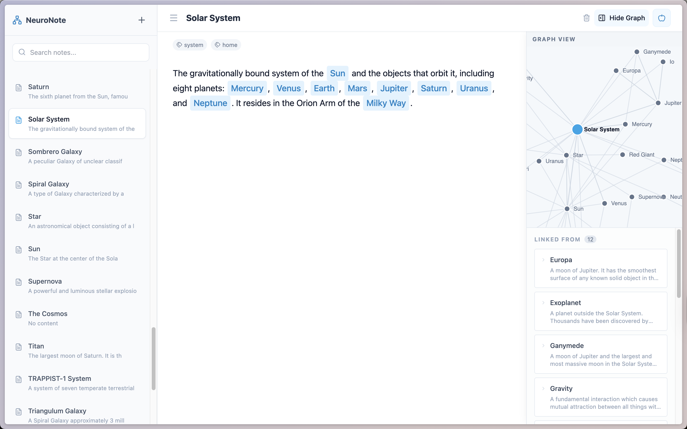

# NeuroNote 🧠

A beautiful, local-first note-taking app with graph visualization and Notion-style markdown editing. All your notes are saved as files in the project - no cloud, no API keys needed!


## 📸 Screenshot

<div align="center">
  
  <p><em>NeuroNote in action: Rich markdown editor with bidirectional links and interactive knowledge graph</em></p>
</div>

## ✨ Features

### 📝 Rich Markdown Editor
- **Slash Commands** - Type `/` to access formatting options (just like Notion!)
  - Headings (H1, H2, H3)
  - Lists (bullet & numbered)
  - Block quotes
  - Code blocks & inline code
  - Bold, italic formatting
  - Horizontal dividers
- **Live Preview** - See formatted text as you type, no raw markdown syntax
- **@ Mentions** - Link notes together with `@` for quick note linking

### 🕸️ Interactive Knowledge Graph
- **Visual Network** - See all your notes and their connections
- **Force-Directed Layout** - Nodes organize themselves automatically
- **Zoom & Pan** - Navigate large graphs easily
- **"I'm Here" Button** - Quickly locate the current note in the graph
- **Click Nodes** - Jump to any note directly from the graph

### 🔗 Bidirectional Linking
- **Wiki-style Links** - Use `[[Note Title]]` to link notes
- **Automatic Backlinks** - See which notes reference the current one
- **Link Suggestions** - Get smart suggestions as you type

### 💾 Local-First Architecture
- **File-Based Storage** - All notes saved to `data/notes.json`
- **No Cloud Required** - Works completely offline
- **Full Data Control** - Your notes, your files, your machine
- **Easy Backup** - Just copy one file to backup everything

### 🎨 Beautiful UI
- Clean, modern interface
- Smooth animations
- Resizable panels
- Keyboard shortcuts
- Dark mode ready (styles in place)

## 🚀 Quick Start

### Prerequisites
- Node.js 18+ installed

### Installation

1. **Clone the repository**
   ```bash
   git clone https://github.com/mkrtlc/NeuroNote.git
   cd NeuroNote
   ```

2. **Install dependencies**
   ```bash
   npm install
   ```

3. **Start the app**
   ```bash
   npm start
   ```

   This launches:
   - Backend API server on `http://localhost:3003`
   - Frontend dev server on `http://localhost:3000`

4. **Open in browser**
   - Navigate to `http://localhost:3000`
   - Start creating notes!

Your notes are automatically saved to `data/notes.json` ✨

## 📖 How to Use

### Creating & Editing Notes
1. Click the **+** button in the sidebar to create a new note
2. Type `/` anywhere in the editor to see formatting options
3. Type `@` to link to other notes
4. All changes are auto-saved

### Slash Commands
Press `/` in the editor to access:
- **Headings** - `# H1`, `## H2`, `### H3`
- **Bold** - `**text**`
- **Italic** - `*text*`
- **Code** - `` `inline code` `` or ``` ```code block``` ```
- **Lists** - Bullet (`-`) or Numbered (`1.`)
- **Quote** - `> quote`
- **Divider** - `---`

### Linking Notes
- Type `@` or use `[[Note Title]]` to create links
- Linked notes show up in the graph view
- Backlinks appear automatically in the right panel

### Graph Navigation
- **Zoom** - Mouse wheel or zoom buttons
- **Pan** - Click and drag
- **Find Current Note** - Click the "I'm Here" button
- **Open Note** - Click any node in the graph

### Search
- Use the search bar at the top to find notes by title
- Results appear instantly as you type

## 📁 Project Structure

```
neuronote/
├── data/
│   └── notes.json              # Your notes database (JSON file)
├── components/
│   ├── RichEditor.tsx          # Markdown editor with slash commands
│   ├── GraphView.tsx           # Interactive knowledge graph
│   └── Sidebar.tsx             # Note list & search
├── services/
│   └── storageService.ts       # File I/O operations
├── utils/
│   └── markdownParser.ts       # Markdown ↔ HTML conversion
├── server.js                   # Express backend (file operations)
├── App.tsx                     # Main React component
└── index.html                  # Entry point
```

## 🛠️ Tech Stack

- **Frontend**
  - React 19 - UI framework
  - TypeScript - Type safety
  - D3.js - Graph visualization
  - Vite - Build tool & dev server
  - Tailwind CSS - Styling
  - Lucide React - Icons

- **Backend**
  - Express.js - REST API
  - Node.js - File system operations
  - CORS - Cross-origin requests

## 🎯 Keyboard Shortcuts

- `/` - Open formatting menu
- `@` - Link to note
- `Esc` - Close menus
- `↑` `↓` - Navigate menus
- `Enter` - Select menu item

## 📦 Building for Production

```bash
npm run build
```

This creates an optimized build in the `dist` folder.

## 🔒 Privacy & Data

- **100% Local** - All data stays on your machine
- **No Analytics** - No tracking, no telemetry
- **No Cloud Sync** - Your notes never leave your computer
- **Full Control** - You own the data file

## 🤝 Contributing

Contributions are welcome! Please feel free to submit a Pull Request.

1. Fork the repository
2. Create your feature branch (`git checkout -b feature/AmazingFeature`)
3. Commit your changes (`git commit -m 'Add some AmazingFeature'`)
4. Push to the branch (`git push origin feature/AmazingFeature`)
5. Open a Pull Request

## 📄 License

This project is licensed under the MIT License - see the [LICENSE](LICENSE) file for details.

## 🙏 Acknowledgments

- Inspired by Notion, Obsidian, and Roam Research
- Built with modern web technologies
- Community-driven development

## 📮 Contact & Support

- **Issues** - [GitHub Issues](https://github.com/mkrtlc/NeuroNote/issues)
- **Discussions** - [GitHub Discussions](https://github.com/mkrtlc/NeuroNote/discussions)

---

Made with ❤️ by developers who love taking notes
